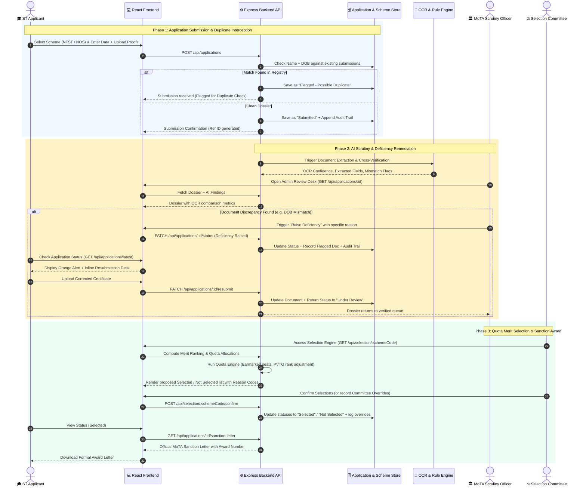
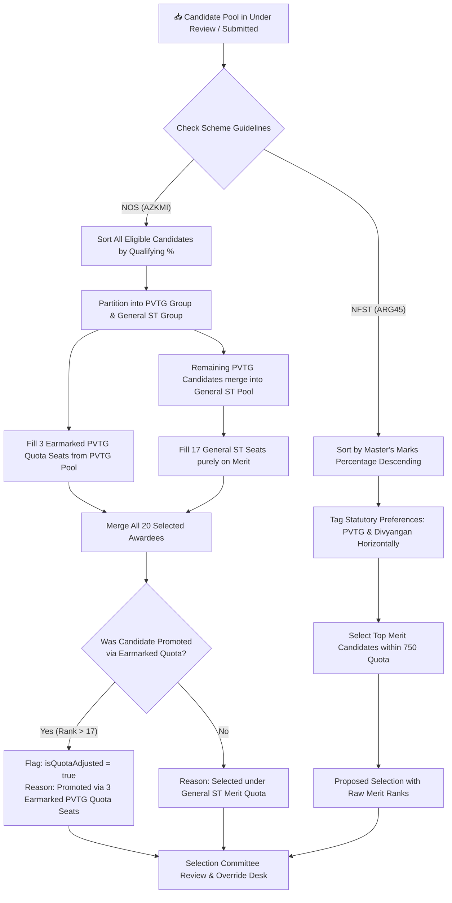
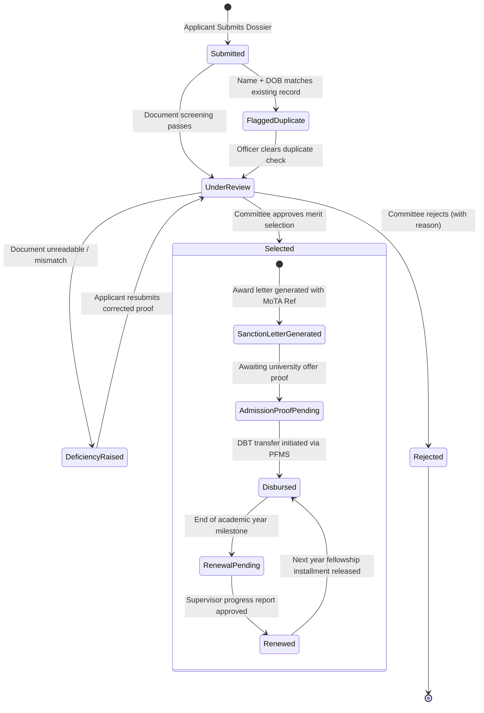
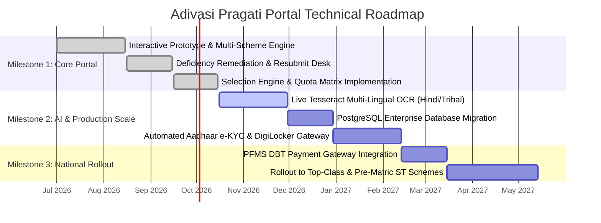

# 🌿 Adivasi Pragati Portal
### AI-Enabled Multi-Scheme Scholarship & Fellowship Lifecycle Management System for Scheduled Tribes

> **Smart India Hackathon 2026** · Problem Statement **ID 26239** · Theme: *Smart Education* · Category: *Software*  
> **Target Ministry:** Ministry of Tribal Affairs (MoTA), Government of India  
> **Team:** Virgofalc0n · **Team ID:** 143737

---

[](https://www.sih.gov.in/)
[](https://tribal.nic.in/)
[%20%7C%20NOS%20(AZKMI)-10B981?style=for-the-badge)](#-rule-configurable-engine-one-platform-n-schemes)
[](frontend/)
[](backend/)
[](#-the-ai-verification--extraction-pipeline)

---

## 📑 Table of Contents

- [Executive Summary](#-executive-summary)
- [The Problem vs Our Solution](#-the-problem-vs-our-solution)
- [Complete System Workflows](#-complete-system-workflows)
  - [1. End-to-End System Lifecycle Workflow](#1-end-to-end-system-lifecycle-workflow)
  - [2. Multi-Actor Interactive Sequence Workflow](#2-multi-actor-interactive-sequence-workflow)
  - [3. Closed-Loop Deficiency Remediation Workflow](#3-closed-loop-deficiency-remediation-workflow)
  - [4. Quota-Aware Merit Selection Algorithm Workflow](#4-quota-aware-merit-selection-algorithm-workflow)
  - [5. Post-Selection & DBT State Machine Workflow](#5-post-selection--dbt-state-machine-workflow)
- [Key Architectural Pillars](#-key-architectural-pillars)
  - [1. Zero-Code Scheme Configuration Engine](#1-zero-code-scheme-configuration-engine)
  - [2. Intelligent OCR & Document Scrutiny](#2-intelligent-ocr--document-scrutiny)
  - [3. Automated Fraud & Duplicate Application Detection](#3-automated-fraud--duplicate-application-detection)
  - [4. Explainable Selection with Committee Override](#4-explainable-selection-with-committee-override)
  - [5. Tamper-Evident Immutable Audit Trail](#5-tamper-evident-immutable-audit-trail)
- [User Journeys by Role](#-user-journeys-by-role)
- [Repository & File Architecture](#-repository--file-architecture)
- [API Reference](#-api-reference)
- [Quick Start Guide](#-quick-start-guide)
- [Demo Personas & Evaluation Scenarios](#-demo-personas--evaluation-scenarios)
- [Security, Compliance & Feasibility](#-security-compliance--feasibility)
- [Roadmap & Vision](#-roadmap--vision)

---

## 📌 Executive Summary

The **Adivasi Pragati Portal** is an enterprise-grade digital public infrastructure designed to transform how higher education scholarships and overseas fellowships are administered for Scheduled Tribe (ST) scholars across India.

Currently, schemes like the **National Fellowship for Higher Education of ST Students (NFST - ARG45)** and the **National Overseas Scholarship (NOS - AZKMI)** face critical bottlenecks:
- Multi-week verification delays due to manual document checks.
- Fragmented rules across different scheme guidelines.
- Disqualifications caused by late discovery of minor document typos.
- Lack of explainable quota tracking for Particularly Vulnerable Tribal Groups (**PVTG**) and Persons with Disabilities (**Divyangan**).

**Adivasi Pragati Portal solves this end-to-end:**
1. **Dynamic Configuration:** Supports $N$ government schemes with distinct eligibility, document requirements, and quota models without code changes.
2. **AI/OCR Scrutiny:** Reads caste certificates, marksheets, and foreign university offers, flagging mismatches instantly.
3. **Closed-Loop Deficiency Remediation:** Allows applicants to re-upload only flagged files directly from their tracking dashboard, immediately returning their dossier to review.
4. **Quota-Aware Merit Selection:** Automatically computes merit ranks while upholding statutory reservations (e.g., earmarked PVTG seats with rank promotions and explainable audit remarks).
5. **Human-in-the-Loop Governance:** Ministry officers maintain complete discretion with transparent committee override logging and sanction letter generation.

---

## ⚖️ The Problem vs Our Solution

| Conventional MoTA Scholarship Process | Adivasi Pragati Portal Transformation |
| :--- | :--- |
| **Siloed Portal Codebases:** Separate software developed for each scheme (NFST, NOS, Top Class, etc.). | **Single Configurable Engine:** One engine configured via dynamic JSON schemas. Adding a new scheme takes minutes, not months. |
| **Late Deficiency Discovery:** Missing/blurry documents detected 6–8 weeks into review, forcing outright rejection. | **Real-Time AI Scrutiny & In-line Remediation:** Immediate optical verification; applicants fix flagged documents in a dedicated dashboard. |
| **Manual Quota Computations:** Complex manual sorting to reconcile general ST merit with PVTG and Divyangan reservations. | **Deterministic Quota Engine:** Automated merit sorting with transparent PVTG promotions and statutory preference tags. |
| **Opaque Selection & Overrides:** Difficult to audit why a candidate was picked or why a manual override was made. | **Transparent & Auditable:** Every state transition records timestamp, author, previous status, and justification reason. |
| **Disconnected Post-Award Lifecycle:** Disconnect between selection, admission letter collection, and PFMS/DBT release. | **Unified Post-Selection Pipeline:** Integrated state machine covering Sanction Letter generation, admission verification, and DBT disbursement. |

---

## 🔄 Complete System Workflows

The portal streamlines the scholarship lifecycle across five coordinated workflows.

### 1. End-to-End System Lifecycle Workflow

```mermaid
flowchart TD
    %% Styling
    classDef startEnd fill:#1E293B,stroke:#0F172A,stroke-width:2px,color:#fff;
    classDef process fill:#F8FAFC,stroke:#3B82F6,stroke-width:2px,color:#0F172A;
    classDef decision fill:#FEF3C7,stroke:#D97706,stroke-width:2px,color:#92400E;
    classDef alert fill:#FEE2E2,stroke:#EF4444,stroke-width:2px,color:#991B1B;
    classDef success fill:#ECFDF5,stroke:#10B981,stroke-width:2px,color:#065F46;

    Start([🎓 Applicant Submits Application]) :::startEnd --> DuplicateCheck{Duplicate or Fraudulent<br/>Submission?} :::decision

    %% Branch A: Duplicate Check
    DuplicateCheck -- "Yes (Same Name + DOB)" --> FlagDuplicate["Flagged - Possible Duplicate<br/>Queued for Anti-Fraud Scrutiny"] :::alert
    DuplicateCheck -- "No (Unique Record)" --> StatusSubmitted["Status: Submitted<br/>Saved in Audit Trail"] :::process

    %% Branch B: Document Analysis
    StatusSubmitted --> AIAnalysis["AI / OCR Verification Engine<br/>• Tesseract Text Extraction<br/>• Cross-match Name, DOB & %<br/>• Quota Document Integrity"] :::process
    AIAnalysis --> ScrutinyReview["Status: Under Review<br/>MoTA Scrutiny Officer Desk"] :::process

    ScrutinyReview --> DefCheck{Discrepancy /<br/>Deficiency Detected?} :::decision
    
    %% Branch C: Deficiency Loop
    DefCheck -- "Yes (Missing/Mismatch Doc)" --> RaiseDef["Status: Deficiency Raised<br/>• Flagged Document Isolated<br/>• Specific Reason Issued"] :::alert
    RaiseDef --> StudentAlert["Applicant Alerted via Dashboard<br/>Corrective Upload Desk Activated"] :::process
    StudentAlert --> StudentResubmit["Applicant Uploads Corrected Document<br/>(Resubmission Desk)"] :::process
    StudentResubmit --> ResubmitAudit["Audit Log Appended<br/>Returns to Under Review"] :::process
    ResubmitAudit --> ScrutinyReview

    %% Branch D: Selection & Committee
    DefCheck -- "No (Verified Complete)" --> QuotaMeritEngine["Quota-Aware Merit Selection Engine<br/>• NFST: Master's % + Priority Queue<br/>• NOS: 17 General ST + 3 PVTG Earmarked"] :::process

    QuotaMeritEngine --> CommitteeReview["Selection Committee Review Desk<br/>• Merit Ranks Evaluated<br/>• Quota Promotions Verified<br/>• Manual Override Option (Logged)"] :::process

    CommitteeReview --> FinalDecision{Committee Decision} :::decision

    FinalDecision -- "Rejected" --> StatusRejected["Status: Rejected<br/>Reason Recorded & Candidate Notified"] :::alert
    FinalDecision -- "Selected" --> StatusSelected["Status: Selected<br/>Official Selection Confirmed"] :::success

    %% Branch E: Post-Selection & DBT
    StatusSelected --> SanctionGen["Generate Digital Sanction Letter<br/>• Official MoTA Award Number<br/>• Tenure & Monthly/Annual Rate"] :::success
    SanctionGen --> AdmissionProof["Status: Admission Proof Pending<br/>(For Overseas / University Confirmation)"] :::process
    AdmissionProof --> DBTDisbursed["Status: Disbursed<br/>DBT PFMS Gateway Handoff"] :::success
    DBTDisbursed --> AnnualRenewal["Status: Renewal Pending<br/>Annual Academic Progress Verification"] :::process
    AnnualRenewal --> RenewedStatus["Status: Renewed<br/>Next Fellowship Installment Released"] :::success
    RenewedStatus --> End([🏆 Scholar Successfully Funded]) :::startEnd
```

---

### 2. Multi-Actor Interactive Sequence Workflow

This sequence diagram illustrates how data flows between the **Applicant**, the **React Frontend**, the **Express API**, the **AI/OCR Engine**, and the **Ministry Scrutiny Committee**.



---

### 3. Closed-Loop Deficiency Remediation Workflow

In standard government workflows, an incorrect document results in an application being discarded. The Adivasi Pragati Portal isolates the problematic document, informs the student with clear instructions, and re-evaluates the submission seamlessly:

```mermaid
flowchart LR
    subgraph OfficerDesk["🏛️ Scrutiny Desk"]
        OD1[Scrutiny Officer inspects OCR Flags] --> OD2[Select Flagged Document]
        OD2 --> OD3[Choose or Type Specific Deficiency Reason]
        OD3 --> OD4[Action: Status → 'Deficiency Raised']
    end

    subgraph ApplicantDesk["🎓 Applicant Self-Remediation Desk"]
        AD1[Applicant logs in] --> AD2[Prominent Orange Alert Banner]
        AD2 --> AD3[Read Exact Officer Note & Affected Document]
        AD3 --> AD4[Select Corrected PDF File]
        AD4 --> AD5[Click: 'Submit Corrected Document']
    end

    subgraph SystemAutomations["⚙️ Automated System State"]
        SA1[Update Application Record] --> SA2[Save Old Reason in History]
        SA2 --> SA3[Switch Status → 'Under Review']
        SA3 --> SA4[Append Timestamped Event in Audit Trail]
        SA4 --> SA5[Dossier Re-Enters Officer Review Queue]
    end

    OD4 ==> AD1
    AD5 ==> SA1
    SA5 -.-> OD1
```



---

### 4. Quota-Aware Merit Selection Algorithm Workflow

The portal features dedicated selection algorithms tailored to each scheme's statutory guidelines:



#### Comparison of Implemented Scheme Selection Rules

| Metric / Rule | NFST (ARG45) Scheme | NOS (AZKMI) Scheme |
| :--- | :--- | :--- |
| **Full Title** | National Fellowship for Higher Education of ST Students | National Overseas Scholarship for ST Candidates |
| **Degree Coverage** | Full-time M.Phil & Ph.D. in Indian Universities | Masters, Ph.D. & Post-Doctoral studies abroad |
| **Minimum Qualifying Marks** | $\ge 55.0\%$ in Master's degree | $\ge 60.0\%$ in qualifying degree |
| **Family Income Ceiling** | No Income Ceiling | Total family income $\le ₹6,00,000/\text{year}$ |
| **Selection Mode** | Pure Merit Ranking with Preference Flags | 2-Tier Quota: 17 General ST + 3 PVTG Earmarked |
| **Statutory Benefit** | ₹25,000/mo (M.Phil) or ₹28,000/mo (Ph.D.) | Up to ₹12L–₹18L/yr living allowance + Full Foreign Tuition |
| **Earmarked Reservation** | Priority queue for PVTG; 5% Divyangan (PWD) | 3 dedicated PVTG seats; unfulfilled merge to open merit |

---

### 5. Post-Selection & DBT State Machine Workflow

Application lifecycle does not stop at selection. The system models the complete disbursement and renewal lifecycle:



---

## 🏛️ Key Architectural Pillars

### 1. Zero-Code Scheme Configuration Engine
Instead of hardcoding eligibility rules, the portal implements a metadata-driven architecture. Ministry administrators can configure schemes via `/admin/schemes`:
- Required document lists and custom upload instructions.
- Degree levels (`M.Phil`, `PhD`, `Masters`, `Post-Doc`).
- Minimum qualifying percentage thresholds and income ceilings.
- Quota seat counts (e.g. 750 for NFST, 20 for NOS) and reservation categories.
- Benefit calculation formulas (monthly stipends vs annual overseas grants).

### 2. Intelligent OCR & Document Scrutiny
Integrates an automated document analysis engine (powered by Tesseract OCR / Computer Vision pipelines):
- Optical character recognition with word-by-word and field-level confidence scores.
- Entity extraction for Name, Date of Birth, Caste Certificate Number, and Issuing Authority.
- Form-versus-Certificate cross-verification to identify discrepancies (e.g., Form DOB `1998-05-14` vs Certificate OCR `1997-08-12`).
- Digital signature and official revenue authority seal verification indicators.

### 3. Automated Fraud & Duplicate Application Detection
To eliminate double-dipping across schemes or duplicate submissions in the same cycle:
- Normalizes and tokenizes applicant names and dates of birth.
- Performs fuzzy-match scrutiny across active database entries upon submission.
- Flags potential duplicates with `Flagged - Possible Duplicate` status and references the existing dossier ID without dropping the submission.

### 4. Explainable Selection with Committee Override
- Every candidate receives transparent decision explanations (e.g., *"Selected on Master's merit ranking (Rank #1)"* or *"Promoted into top selection via 3 earmarked PVTG quota seats (Raw Rank #8)"*).
- Members of the Selection Committee have the authority to override automated decisions when justified, recording mandatory remarks and user identities in the immutable audit trail.

### 5. Tamper-Evident Immutable Audit Trail
Every application dossier maintains an internal `auditTrail` array. Any operation—be it an initial submission, status transition, deficiency issuance, resubmission, or committee override—appends a record containing:
- `timestamp`: ISO-8601 server timestamp.
- `fromStatus` $\to$ `toStatus`: Precise state transition.
- `changedBy`: Email or role of the operating actor.
- `reason`: Legal or procedural justification for the action.

---

## 👥 User Journeys by Role

```
┌─────────────────────────────────────────────────────────────────────────────┐
│                            ST APPLICANT JOURNEY                             │
│                                                                             │
│  [Explore Scheme] ──► [Fill Form & Calculate Grant] ──► [Upload Proofs]     │
│         ▲                                                     │             │
│         │                                                     ▼             │
│  [Download Sanction] ◄── [In-line Resubmission] ◄── [Track Status Stepper]  │
└─────────────────────────────────────────────────────────────────────────────┘

┌─────────────────────────────────────────────────────────────────────────────┐
│                          MOTA SCRUTINY OFFICER                              │
│                                                                             │
│  [Metrics Dashboard] ──► [Filter by Status/Scheme] ──► [Open Dossier]       │
│                                                               │             │
│                                                               ▼             │
│  [Mark Under Review] ◄── [Raise Deficiency Alert] ◄── [Inspect OCR Flags]   │
└─────────────────────────────────────────────────────────────────────────────┘

┌─────────────────────────────────────────────────────────────────────────────┐
│                       SELECTION COMMITTEE / LEADERSHIP                      │
│                                                                             │
│  [Select Scheme Engine] ──► [Run Quota Merit Algorithm] ──► [Inspect Ranks] │
│                                                                   │         │
│                                                                   ▼         │
│  [Issue Sanction Letters] ◄── [Commit Decision Batch] ◄── [Apply Overrides] │
└─────────────────────────────────────────────────────────────────────────────┘
```

---

## 📁 Repository & File Architecture

```
portal/
├── backend/
│   ├── package.json                   # Backend dependencies (Express, CORS)
│   └── src/
│       ├── server.js                  # Server entry point & port fallback logic
│       ├── controllers/
│       │   ├── applicationController.js # Dossier CRUD, resubmit, lifecycle, sanction letters
│       │   ├── schemeController.js      # Dynamic scheme configurations
│       │   └── selectionController.js   # Quota selection engine (NFST + NOS algorithms)
│       ├── data/
│       │   ├── applications.json        # Database store (dossiers, audit trails, flags)
│       │   └── schemes.json             # Scheme configuration repository (ARG45, AZKMI)
│       ├── middleware/
│       │   └── errorHandler.js          # Centralized error handler
│       ├── models/
│       │   ├── Application.js           # Application model, duplicate checks, audit logger
│       │   └── Scheme.js                # Scheme model & configuration validator
│       └── routes/
│           ├── applications.js          # Application routes & lifecycle endpoints
│           ├── auth.js                  # Authentication routes with demo accounts
│           ├── schemes.js               # Scheme configuration routes
│           └── selection.js             # Merit ranking & confirmation routes
│
├── frontend/
│   ├── index.html                     # HTML5 root with MoTA typography & meta tags
│   ├── package.json                   # Frontend dependencies (React 18, Vite)
│   ├── vite.config.js                 # Vite development & build setup
│   └── src/
│       ├── App.jsx                    # Route switchboard & role guards
│       ├── main.jsx                   # React root hydration
│       ├── components/
│       │   ├── admin/
│       │   │   ├── ApplicantTable.jsx # Admin data grid with status filters & badges
│       │   │   └── ReviewPanel.jsx    # OCR analysis viewer & deficiency issuance desk
│       │   ├── applicant/
│       │   │   ├── ApplicationForm.jsx # Scheme-aware application input form
│       │   │   └── DocumentUpload.jsx  # Multi-document upload component
│       │   └── shared/
│       │       ├── Button.jsx         # Accessible button primitives
│       │       ├── Card.jsx           # Clean surface card container
│       │       ├── Navbar.jsx         # Header navigation with role-aware actions
│       │       ├── StatusBadge.jsx    # High-contrast color-coded status badges
│       │       └── Toast.jsx          # Non-blocking user notification toast
│       ├── context/
│       │   └── AuthContext.jsx        # Authentication state & role persistence
│       ├── data/
│       │   └── mockDocumentAnalysis.js# Simulated AI/OCR verification profiles
│       ├── pages/
│       │   ├── admin/
│       │   │   ├── ApplicationReviewPage.jsx # Individual dossier inspection view
│       │   │   ├── DashboardPage.jsx         # Administrative KPI overview & table
│       │   │   └── SchemeConfigPage.jsx      # Zero-code scheme rule editor
│       │   └── applicant/
│       │       ├── ApplyPage.jsx             # Candidate submission workflow
│       │       ├── LoginPage.jsx             # Role-based login with quick-fill
│       │       └── StatusPage.jsx            # Live stepper, banners & resubmit desk
│       ├── services/
│       │   └── api.js                 # Axios/Fetch HTTP client for backend APIs
│       └── styles/
│           ├── index.css              # Global tokens, typography, and utility classes
│           └── theme.css              # MoTA national palette (Saffron, Navy, Forest Green)
│
└── README.md                          # Comprehensive system documentation
```

---

## 🔌 API Reference

### 1. Authentication (`/api/auth`)
| Method | Endpoint | Description |
| :--- | :--- | :--- |
| `POST` | `/api/auth/login` | Authenticate as applicant or ministry admin with credentials. |

### 2. Schemes Configuration (`/api/schemes`)
| Method | Endpoint | Description |
| :--- | :--- | :--- |
| `GET` | `/api/schemes` | Retrieve all active scheme configurations. |
| `GET` | `/api/schemes/:code` | Retrieve configuration for a specific scheme (`ARG45` or `AZKMI`). |
| `POST` | `/api/schemes` | Create and register a brand new scheme configuration. |
| `PUT` | `/api/schemes/:code` | Modify existing scheme rules, document mandates, or quotas. |

### 3. Application Lifecycle (`/api/applications`)
| Method | Endpoint | Description |
| :--- | :--- | :--- |
| `GET` | `/api/applications` | Retrieve all submitted dossiers (supports admin status filtering). |
| `GET` | `/api/applications/:id` | Fetch complete dossier, uploaded files, and AI analysis data. |
| `POST` | `/api/applications` | Submit a new scholarship application with fraud/duplicate detection. |
| `PATCH`| `/api/applications/:id/status` | Update review status (`Under Review`, `Deficiency Raised`, `Rejected`). |
| `PATCH`| `/api/applications/:id/resubmit` | Resubmit a corrected document to clear a deficiency. |
| `PATCH`| `/api/applications/:id/lifecycle`| Advance post-award state machine (Sanctioned, Disbursed, Renewed). |
| `GET` | `/api/applications/:id/sanction-letter` | Generate and fetch official MoTA digital sanction letter. |

### 4. Quota Merit Selection Engine (`/api/selection`)
| Method | Endpoint | Description |
| :--- | :--- | :--- |
| `GET` | `/api/selection/:schemeCode` | Execute quota algorithm and return ranked candidate pool with reason codes. |
| `POST`| `/api/selection/:schemeCode/confirm` | Finalize committee decisions, logging override reasons and author names. |

### 5. Health & Diagnostics (`/api/health`)
| Method | Endpoint | Description |
| :--- | :--- | :--- |
| `GET` | `/api/health` | Returns service status, active scheme codes, and server timestamp. |

---

## ⚡ Quick Start Guide

### Prerequisites
- **Node.js**: v18.0.0 or higher
- **npm**: v9.0.0 or higher

### Step 1: Clone the Repository
```bash
git clone https://github.com/user4823-oss/Adivasi-Pragati-Portal.git
cd Adivasi-Pragati-Portal
```

### Step 2: Start the Express Backend API
```bash
cd backend
npm install
npm start
```
> The backend server initializes at **`http://localhost:5000`** (auto-falls back to `5001` if port 5000 is occupied).

### Step 3: Start the React Frontend Application
Open a new terminal window:
```bash
cd frontend
npm install
npm run dev
```
> The Vite development server launches at **`http://localhost:5173`**.

---

## 🔑 Demo Personas & Evaluation Scenarios

The portal includes pre-seeded demonstration data to test every core capability immediately without manual entry.

### Pre-Configured Demo Credentials

| Persona Role | User Email | Password | Quick-Fill Button |
| :--- | :--- | :--- | :--- |
| 🎓 **Scheduled Tribe Applicant** | `applicant@nfst.gov.in` | `applicant123` | ✅ Available on Login Screen |
| 🏛️ **MoTA Ministry Admin / Officer** | `admin@mota.gov.in` | `admin123` | ✅ Available on Login Screen |

---

### Key Evaluation Scenarios for Evaluators

#### Scenario A: Inspect AI OCR & Issue Deficiency
1. Log in as **Ministry Admin** (`admin@mota.gov.in`).
2. On the **Application Review Dashboard**, locate candidate **Rajeshwar Bodo (`NFST-2026-005`)**.
3. Notice the red alert: **DOB Mismatch Detected** (Form: `1998-05-14` vs Certificate OCR: `1997-08-12`, OCR Confidence: `71%`).
4. Click **Raise Deficiency to Candidate**, select *Caste Certificate*, pick the standard reason, and submit.
5. Log in as **Applicant** (`applicant@nfst.gov.in` or via status link): observe the **Orange Deficiency Banner** instructing the scholar on how to rectify the issue.
6. Use the **Document Correction Resubmission Desk** to upload the corrected file and click **Submit Corrected Document**.
7. Observe the status automatically revert to **Under Review** with an updated audit note.

#### Scenario B: Automated Duplicate Detection
1. Log in as **Applicant**.
2. Submit a new application using the name **"Amit Bhagat"** and DOB **"1998-11-04"** (which matches existing record `NFST-2026-006`).
3. Notice that the system flags the submission as **`Flagged - Possible Duplicate`** and references the original submission ID to prevent double-claiming.

#### Scenario C: Earmarked PVTG Quota Execution (NOS Scheme)
1. Log in as **Ministry Admin** and navigate to the **Selection Engine** for Scheme **`AZKMI` (NOS)**.
2. Observe how the 20 total seats are partitioned into **17 General ST + 3 Earmarked PVTG seats**.
3. View how PVTG candidates with qualifying scores are allocated to the 3 earmarked seats, with explicit reason codes explaining any quota-based rank promotion.

#### Scenario D: Zero-Code Scheme Management
1. In the Admin portal, navigate to **Scheme Configurator** (`/admin/schemes`).
2. Click **Create New Scheme** or **Edit Existing Scheme (ARG45 / AZKMI)**.
3. Update eligibility marks from `55%` to `50%` or adjust the monthly fellowship rates.
4. Save changes and navigate to the **Applicant Apply Page**: notice that the form immediately reflects the updated criteria dynamically.

---

## 🛡️ Security, Compliance & Feasibility

- **Statutory Data Protection:** Role-based access control (RBAC) ensures applicant dossiers can only be viewed by authorized officers or the candidate themselves.
- **Fail-Safe AI Governance:** The AI engine operates strictly as an assistant. Low-confidence OCR scores or document discrepancies trigger human review rather than automatic rejection.
- **Audit Compliance:** Immutable logging ensures that every status modification or selection override is accountable to MoTA scrutiny authorities.
- **Scalable Architecture:** Designed for transition to PostgreSQL and integration with national registries including **DigiLocker**, **Aadhaar e-KYC**, and **DBT Bharat / PFMS**.

---

## 🗺️ Roadmap & Vision



---

## 👥 Team Virgofalc0n

Built with dedication for **Smart India Hackathon 2026** to empower Scheduled Tribe scholars with dignified, transparent, and accelerated access to higher education.

*Ministry of Tribal Affairs (MoTA) · Government of India*